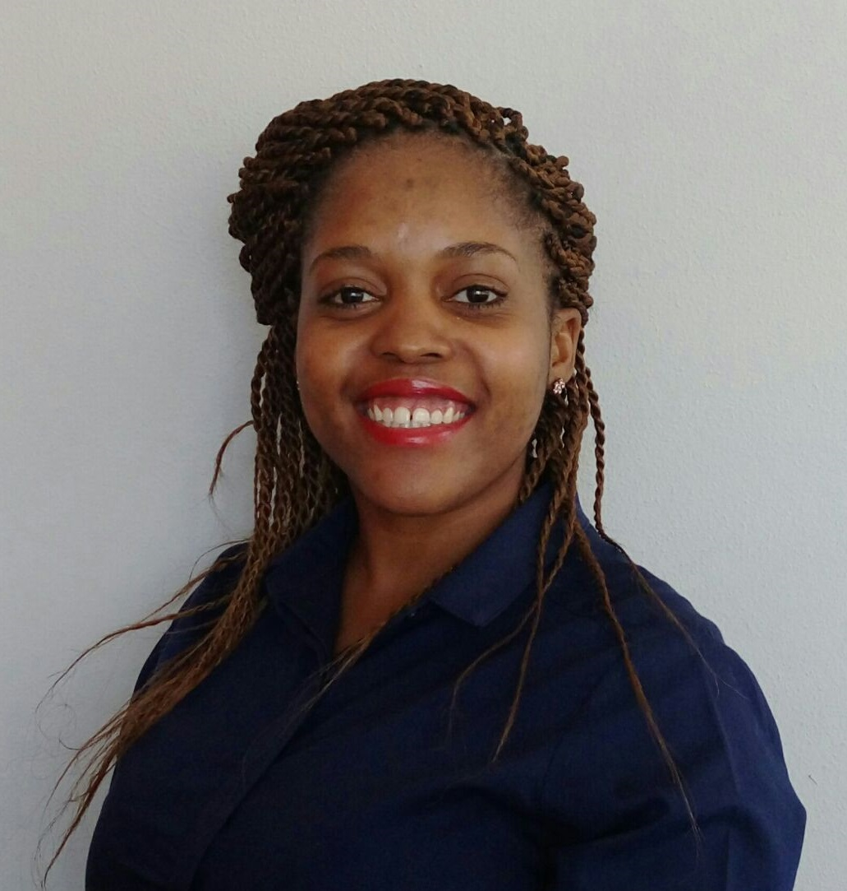

I am from Swaziland and I am a PhD student in Economics with [AIFMRM](http://www.aifmrm.uct.ac.za/), the African Institute of Financial Markets and Risk Management at the University of Cape Town. under the supervision of [Dr Co-Pierre Georg](https://cogeorg.github.io/). I also work at the Central Bank of Swaziland in the Financial Stability Unit.

My interests are in financial inclusion, central banks and financial innovation.  {:height="36px" width="36px"}

[Download CV](https://www.dropbox.com/s/j7phm95k0sego35/Nolwazi_CV.pdf?dl=0)

#### Learning from Masters

Include relevant documents here that have helped me

contact details and linkedin link 

